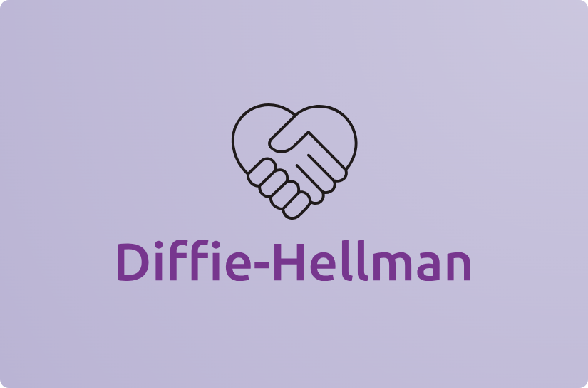

<p align="center">
<a href="https://pkg.go.dev/github.com/erfanmomeniii/diffiehellman?tab=doc"target="_blank">
    
</a>


</p>

# Diffie-Hellman

<b>Diffie-Hellman</b> is a lightweight package that provides an implementation of [diffie-hellman](https://en.wikipedia.org/wiki/Diffie%E2%80%93Hellman_key_exchange) algorithm in Go. for seeing usages check [this](https://pkg.go.dev/github.com/erfanmomeniii/diffiehellman).
<p align="justify">
The Diffie-Hellman is a key-exchange protocol that enables two parties communicating over a public channel to establish a mutual secret without transmitting it over the internet. It allows the two parties to use a public key to encrypt and decrypt their conversation or data using symmetric cryptography.
</p>
<p align="justify">
It is widely used in protocols such as Secure Shell (SSH), Internet Protocol Security (IPSec), and Public Key Infrastructure (PKI) to facilitate secure key exchange and enhance data confidentiality over public networks.
</p>

# Documentation

## Install

```bash
go get github.com/erfanmomeniii/diffiehellman
```   

Next, include it in your application:

```bash
import "github.com/erfanmomeniii/diffiehellman"
``` 

## Quick Start

The following example demonstrates how to use this package for generating the same transport key:

```go
package main

import (
	"fmt"

	"github.com/erfanmomeniii/diffiehellman"
)

func main() {
	clientA, _ := diffiehellman.New(10141)
	clientB, _ := diffiehellman.New(10141)
	// The parameter should be a prime number.

	fmt.Println(clientA.GetPrivateKey(), clientA.GetPublicKey())
	// 4294 5299
	fmt.Println(clientB.GetPrivateKey(), clientB.GetPublicKey())
	// 2560 3789
	fmt.Println(clientA.GenerateTransportKey(clientB.GetPublicKey()))
	// 6933
	fmt.Println(clientB.GenerateTransportKey(clientA.GetPublicKey()))
	// 6933
}
```

## Contributing
Pull requests are welcome. For changes, please open an issue first to discuss what you would like to change.
Please make sure to update tests as appropriate.
